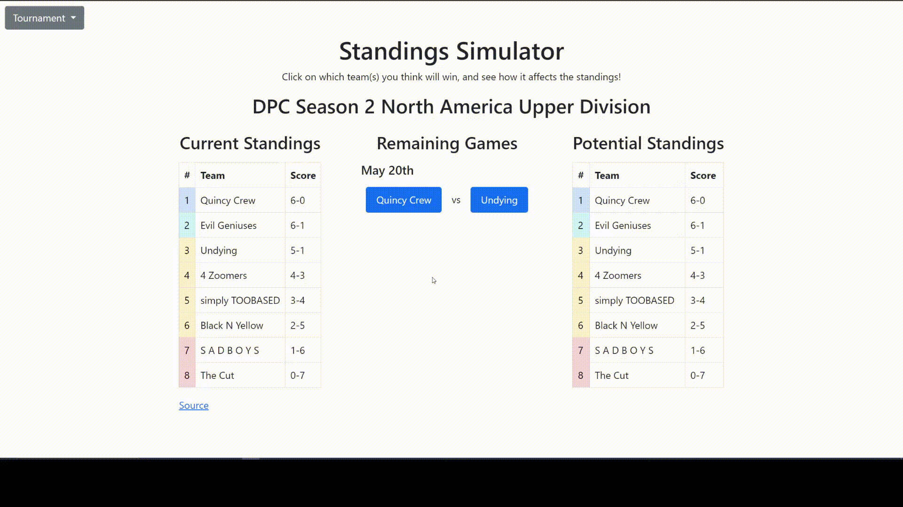

# Standings Simulator
A simulator to see the standings for tournaments after predicting remaining games' outcomes.

## Current Tournaments
- 2021 DPC
  - Season 2 
    - All 6 regions' Upper Division
    - WePlay AniMajor Wild Card & Group Stage
  - TI 10 (both groups)*

*Directly invited teams randomly divided between the two group

## Demos
Predicting a match result and displaying ties: 
 
 
 
Predicting tiebreaker results: 
 

## To Do
- Implement Liquipedia's parent API 
  - Creating tournaments/finding teams/getting remaining games can be created and updated automatically
- Color table rows based on each team's current score and how many games are left to be played
- For DPC Tournaments, display an overall DPC standings based on points
- Optimize sorting (currently uses selection sort because the number of teams has been low)
