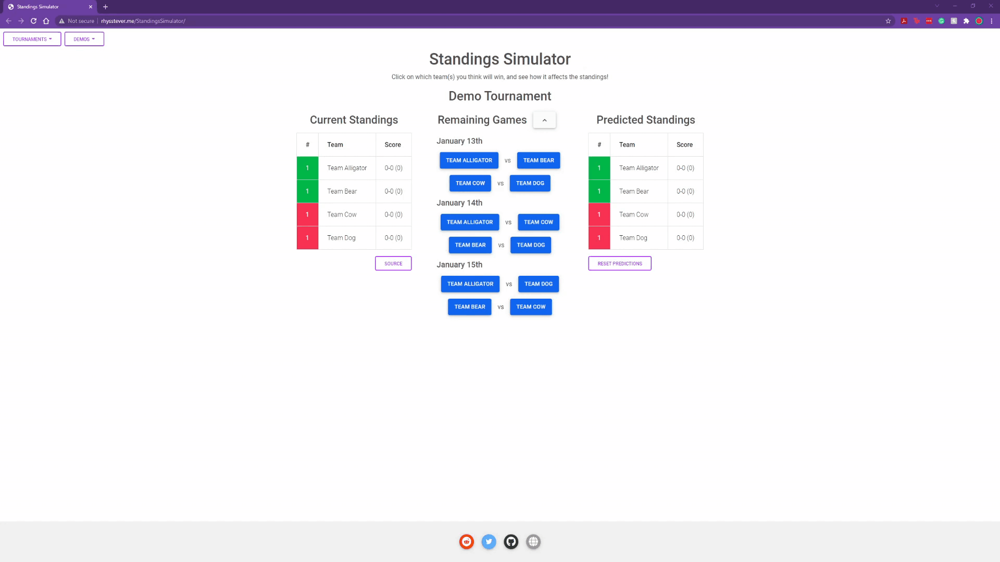
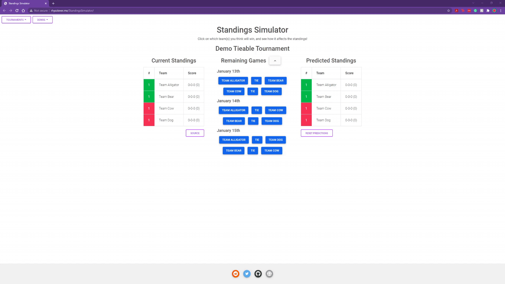
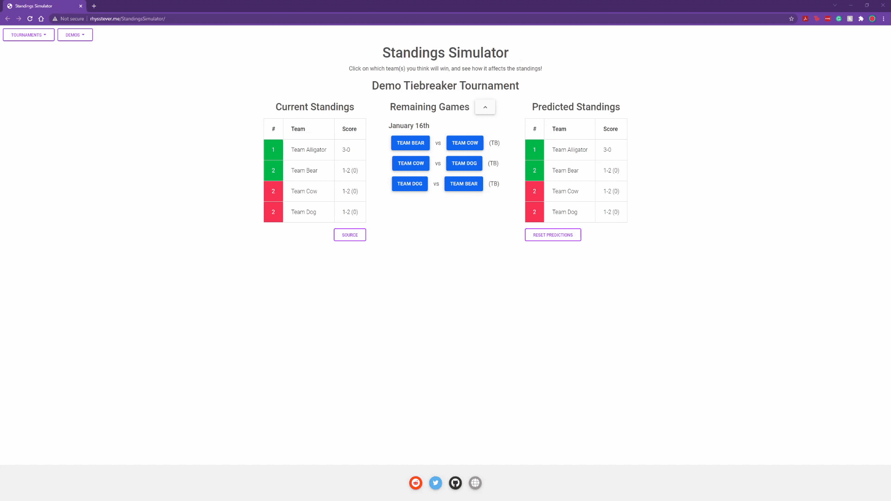

# Standings Simulator
A simulator to see the standings for tournaments after predicting remaining games' outcomes.

## Tournaments
### Currently Displayed
- Dota Pro Circuit Tour 3 Division 1 (all 6 regions)

### To Be Added
- DPC Arlington Major Group Stage (both groups)
- Dota 2 TI 11 Last Chance Qualifier
- Dota 2 TI 11 Group Stage (both groups)

## To Do's
- Create a home "dashboard" page that lets the user select a tournament instead of displaying one automatically
- Allow users to make their own tournaments (entering participating teams and upcoming matches)
- Optimize sorting (currently uses selection sort because the number of teams has been low)

## Previews/Demos
Basic Functionality: (predicting match results, sorting by score, displaying ties, and clearing predictions) 
 
 
 
Predicting series that could end in a tie (like in a best of 2): 
 
 
 
Predicting tiebreaker results: 
 

